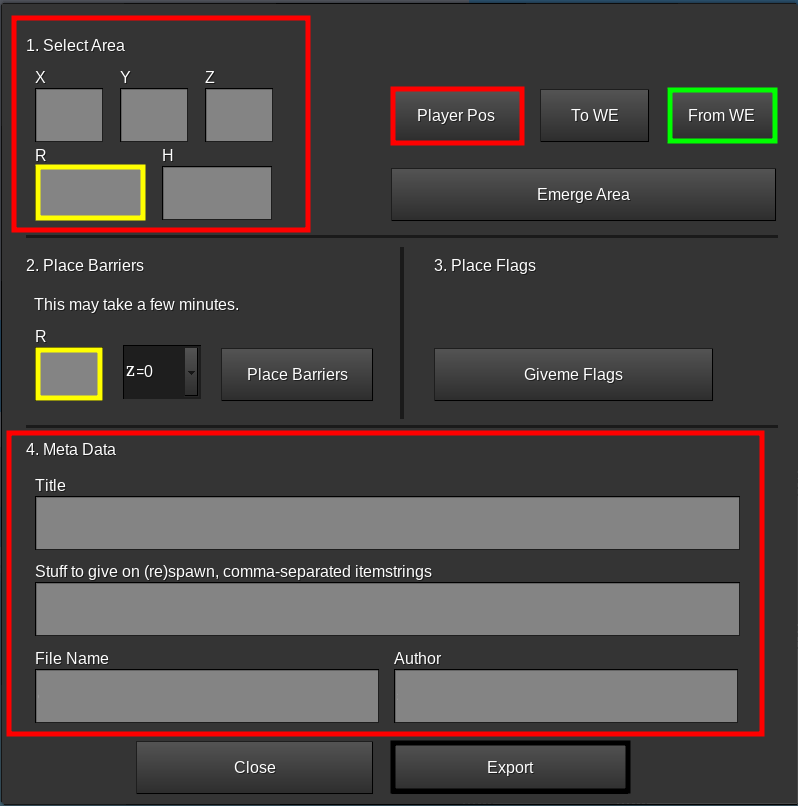

# CTF map-maker mod

## Making a new map

### Youtube Tutorial
https://youtu.be/orBsC9wViUw

### Dependencies
- Minetest 5.0.0 or later (https://minetest.net/)
- Minetest Game (https://github.com/minetest/minetest_game/) (CTF supports most MTG nodes)
- `ctf_map` modpack (copy this folder to `minetest/mods`)
- `worldedit` modpack (WE) (https://content.minetest.net/packages/sfan5/worldedit/)

### Find an area

- The area can be maximum 230x230 blocks in surface area, but it can be lesser.
- Modify the area to *your* unique ctf_map
  - you could add
    - buildings
    - lakes
    - hills
    - etc.
- If you haven't modified the map at all, do the following to speed up barrier placement:

    - Stop Minetest.
    - Open up the world's world.mt
    - Set backend to "dummy".
    - Save.

### The `gui`window

  

There are many ways of placing the barrier:

- Go to the center of the map and click on `Player Pos` and then on `To WE`
  - set a radius and a height for the map
- **Or** select the area of the map via WE
  - Go to one corner of the map and type `//pos 1` in the chat
  - Then go to the opposite corner of the cube and type `//pos 2` in the chat
  - Click on `From WE` to import the positions
  - **If `h` is negative change it to the positive number** (`-130 -> 130`)
- **Both radii must be the same!**
- The rotation of the map has to be `z=0` (currently x=0 creates bugs and errors)
- Click on `Place Barriers` (Note that this has no undo)
- After the barriers are placed, click on `Givme Flags` to get 2 flags and place them at the bases.

### Meta Data

The `gui`window only shows the most important things. You have to add the missing in the `map.conf` later.

### Exporting

- Click on `Export` to export the map-files. This may takes some time

## Map Meta

The metadata of each map are stored in the `map.conf` file and includes all important information about them:
- `name`: Name of the map.
- `author`: Author of the map.
- `hint` [Optional]: A helpful tip for players to understand unique maps.
- `roation`: The rotation of the map. [x|y]
- `r`: Radius of the map.
- `h`: Heigt of the map (**If it's an odd numer, make h=h+1 `107->108`**).
- `team.i`: Name of the team.
- `team.i.color`: Color of the team.
- `team.i.pos`: Position of team `i`'s flag, relative ot the center of schem. **The y-positions of the flags must be an integer!** `30,-32.5,60 -> 30,-33,60`
- `chest.i.from` and `chests.i.to` [Optional]: Positions of diagonal corners of custom chest zone `i`, relative to the center of the schem.
- `chests.i.n` [Optional]: Number if chests in zone `i`
- `license`: Name of license of the map.
- `other` [Optional]: Additional information about the map. This is displayed in the maps catalog.
- `base_node` [Optional]: String of the node around the flags.
- `initial_stuff` [Optional]: Comma-separated list of itemstacks to be given to the player on join and on respawn.
- `treasures` [Optional]: List of treasures to be registered for the map, in a serialized format. Refer to the `treasures` sub-section for more details.
- `start_time` [Optional]: Time of day when the match starts. Default to `0.4` [`0 - 1`].
- `time_speed` [Optional]: Time speed multiplier. Accepts any valid number. Defaults to 1.
- `phys_speed` [Optional]: Player speed multiplier. Accepts any valid number. Defaults to 1.
- `phys_jump` [Optional]: Player jump multiplier. Accepts any valid number. Defaults to 1.
- `phys_gravity` [Optional]: Player gravity multiplier. Accepts any valid number. Defaults to 1.


#### `license`

* Every map must have its own license. Once you've chosen your license, simply add the following line to the `map.conf` file:

  ```properties
  license = <name>
  ```

* If attribution is required (for example if you modify other's map and you have to tell who is author of the original map), that has to be appended to the `license` field.
If you want to tell more infomation, you can use:

  ```properties
  others = <description>
  ```

* If you don't know which license to use, [this list of CC licenses](https://creativecommons.org/use-remix/cc-licenses/) can help you.
* We can only accept Free Software licenses, e.g.`CC BY-SA 4.0`.
* Please know what you are doing when choosing a certain license. For example, you can read information about various licenses and/or consult a lawyer.


#### `treasures`

`treasures` is a list of treasures to be registered for this map in serialized format.

An example `treasures` value that registers steel pick, shotgun, and grenade:

```properties
treasures = default:pick_steel,0.5,5,1,10;shooter:shotgun,0.04,2,1;shooter:grenade,0.08,2,1
```

(See [here](../../../other/treasurer/README.md) to understand the magic numbers)

#### `initial_stuff`
`initial_stuff` are the items given to players at their (re)spawn. The `initial_stuff` field is located in the `map.conf` file. At least a pickaxe and some torches should be given in the map's `initial_stuff`.

An example of `initial_stuff` value that registers a stone pickaxe, 30 cobblestones, 5 torches and a pistol is given below.

```properties
initial_stuff = default:pick_stone,default:cobble 30,default:torch 5,shooter:pistol
```

### `screenshot`

Every map must have its own screenshot in map's folder. It should have an aspect ratio of 3:2 (screenshot 600x400px is suggested).

It should be named `screenshot.png`.

### `skybox` [Optional]

Six images which should be in map's folder.

* `skybox_1.png` - up
* `skybox_2.png` - down
* `skybox_3.png` - east
* `skybox_4.png` - west
* `skybox_5.png` - south
* `skybox_6.png` - north

You have to include skybox license in `license` in `map.conf` file. We can only accept Free Software licenses, e.g. `CC0`, `CC BY 3.0`, `CC BY 4.0`, `CC BY-SA 3.0`, `CC BY-SA 4.0`.
Before you test your skybox images in local CTF game, run the `update.sh` file in the `games/capturetheflag/` folder.

You can find some good skyboxes with suitable licenses at [opengameart.org](https://opengameart.org/art-search-advanced?field_art_tags_tid=skybox) or [www.humus.name](https://www.humus.name/index.php?page=Textures).
## Editing exported map

The easiest way to edit exported maps is the following:
* Create a world using `singlenode` mapgen. Enable `WorldEdit` and `ctf_map` mod,
* Go in the world's folder, create a folder named `schems`, and place the `map.mts` file inside,
* Start the game, `/grantme all` and enable `fly` (there is no ground in singlenode mapgen),
* Do `//1` to set the position where you will generate the map,
* Do `//mtschemplace map` (where `map` is the name of the mts file without `.mts`).

When you finish:

* Place `//1` and `//2` exactly in opposite corners of map (cube),
* Do `//mtschemcreate <new_name>` to create new edited `.mts` file. It will be saved in `schems` folder.
