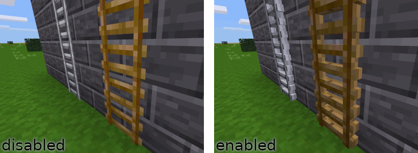
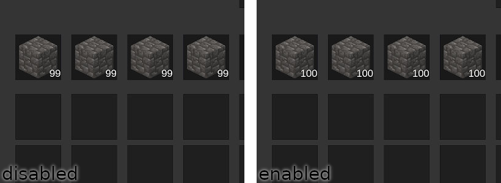
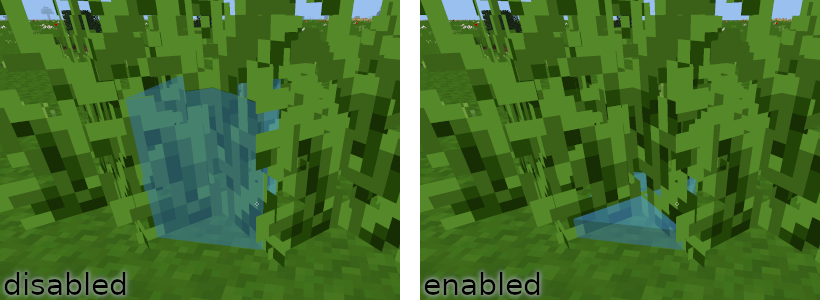
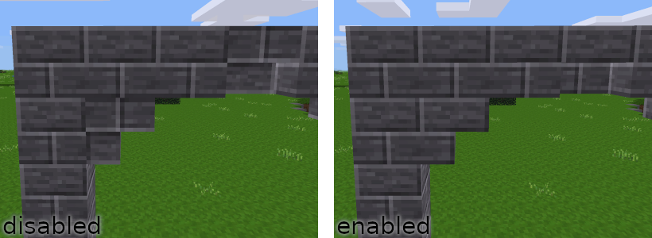
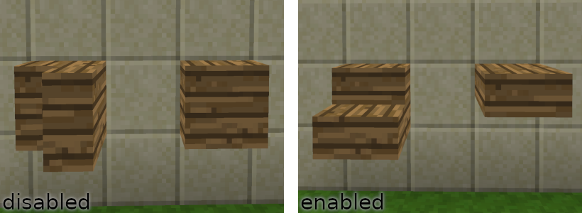
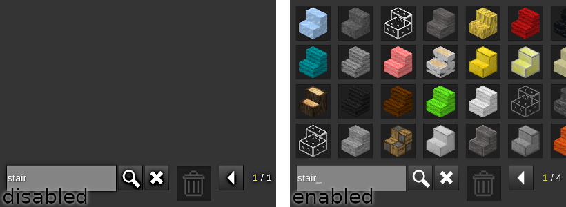

Changes smaller things that are issues for [Minetest Game](https://github.com/minetest/minetest_game), and some well-known mods that are technically fixable but won’t be fixed due to several non-technical reasons.

## Configuration

All configuration options are set to values intended by the redefinitions. For changing or disabling the values set the corresponding options to the preferred values or to the value that disables the redefinition.

The configurations can be set in the global config file used for the server, as well as in a world-specific configuration file located at `./worlds/worldname/_redef.conf`. Global settings overwrite the given defaults and world-specific settings overwrite the global settings and defaults.

### 3D Ladders

* setting: `redef_3d_ladders = true`
* disable: set to `false`
* fixes: [mtg2423]
* default: no 3D ladders

Redefining the 2D ladders so that they use a 3D model. No new textures are needed since he normal textures are used. Only works properly if using the 16x16 default textures or texture packs that use the same size and shape for the ladders.

### Maximum Stack Size

* setting: `redef_stack_max = 100`
* disable: set to 0
* fixes: [mtg1843], [mtg5730], [mtg1724], [mt394]
* default: stack size at 99

It changes the maximum stack size of all registered things whose stack size is 99 to the given `redef_stack_max` value. Unfortunately the maximum stack size of 99 is hardcoded in some places and can’t be changed using a mod.

### Grass Box Height

* setting: `redef_grass_box_height = 2`
* disable: set to 0
* fixes: [mtg1980]
* default: various heights for grass selection boxes

Make grass selection box x/16 high for easy building or punching through regardless of actual height of the box.

### Aligned Textures

* setting: `redef_aligned_textures = true`
* disable: set to `false`
* fixes: [mtg2287], [mtg1931], [mt5222]
* default: textures not aligned for most relevant nodes

This fixes the texture orientation of stairs and slabs regardless of how they were defined to achieve a clean look. This redefinition also world-alignes moreblocks nodes that are nodeboxes (world-alignment of textures only works on nodeboxes).

### Proper Rotation

* setting: `redef_proper_rotation = true`
* disable: set to `false`
* fixes: [moreblocks138] for example
* default: slabs and stairs do not align properly on placement

Moreblocks re-implements all stairs and slabs for unknown reason and thus breaking their placement and auto-rotation. By enabling this, the original functionality is replicated. This also addresses weird placement of *bakedclay* mod’s objects.

### Show Steps (slabs and stairs)

* setting: `redef_show_steps = true`
* disable: set to `false`
* fixes: [moreblocks141] for example
* default: slabs and stairs are hidden in creative inventory

This mainly exists to prevent crashing the server when setting `moreblocks.stairsplus_in_creative_inventory = true` (see example issue). But what this does in general is removing the `not_in_creative_inventory` group from all nodes that have `stair = 1` or `slab = 1` group set. In result all stairs and slabs are shown in creative inventory.

[mtg2423]: https://github.com/minetest/minetest_game/issues/2423
[mtg1843]: https://github.com/minetest/minetest/pull/1843
[mtg5730]: https://github.com/minetest/minetest/issues/5730
[mtg1724]: https://github.com/minetest/minetest_game/issues/1724
[mt394]: https://github.com/minetest/minetest/issues/394
[mtg1980]: https://github.com/minetest/minetest_game/issues/1980
[mtg2287]: https://github.com/minetest/minetest_game/issues/2287
[mtg1931]: https://github.com/minetest/minetest_game/issues/1931
[mt5222]: https://github.com/minetest/minetest/issues/5222
[moreblocks138]: https://github.com/minetest-mods/moreblocks/issues/138
[moreblocks141]: https://github.com/minetest-mods/moreblocks/issues/141
